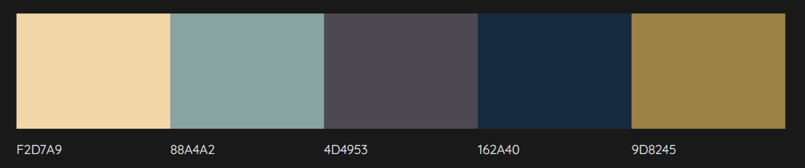
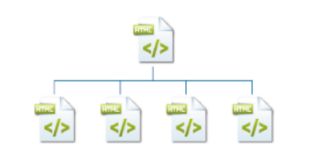
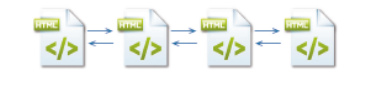
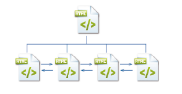
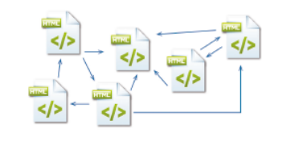
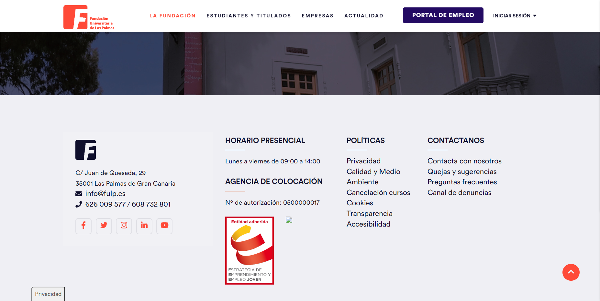

# UF1303
Exámenes sobre esta unidad.

## EPA2

Instrucciones:

1. Leer atentamente y con atención todas las indicaciones.

2. Crea un documento funcional en el que recojas los siguiente detalles que utilizarías en una web que tiene el color azul en su logo principal, usa fuente Sans Serif, está orientada al sector sanitario y su público objetivo son personas aseguradas mayores de 35 años:

        Colores principales:
        Colores secundarios:
        Incluir los tamaños que se usarías en cada tipo de fuente.
        Fuente para textos:
        Fuente para encabezados
        Fuente para pie de foto o similares:

        Los botones inactivos serían:
        Los botones activos serían:

        La página de inicio tiene que tener seguro (apartados necesarios):
        Los elementos visibles y accesibles para el usuario de la web deben ser (elementos web):
        La cabecera de la web debe contener al menos (elementos web):
        El pie de página tiene que contener la información de (elementos web):

3. Se te ofrece la siguiente paleta de colores, define con el n.º hexadecimal de cada color para que lo usarías en la misma web del ejercicio anterior. Añade este apartado dentro del mismo documento anterior:
    Ejemplo: F2343F: Para texto resaltado dentro de la web, bordes a destacar, llamadas de atención en elementos web y para elementos sobre fondo más oscuro.

    

4. Asocia los tipos de estructuras web con la imagen que les represente.

    <table border=0 style="border-spacing: 30px">
    <tr>
    <td style="backgroundcolor: blue">Estructura lineal </td>
    <td></td>
    <td>
    
    </td>
    </tr>
    <tr>
    <td style="backgroundcolor: blue">Estructura red </td>
    <td></td>
    <td>
    
    </td>
    </tr>
    <tr>
    <td style="backgroundcolor: blue">Estructura lineal
    con jerárquica</td>
    <td></td>
    <td>
    
    </td>
    </tr>
    <tr>
    <td style="backgroundcolor: blue">Estructura jerárquica </td>
    <td></td>
    <td>
    
    </td>
    </tr>
    </table>

5. En el siguiente ejercicio demuestra, usando la información aportada en ejercicios anteriores, como sería los estilos aplicados en un pie de página de una página de inicio. Teniendo en cuenta que tendría que aparecer el nombre de la institución, teléfonos de contacto, dirección física, un enlace a una sección de formulario de contacto o incluir un breve formulario de contacto en el pie de página. Genera el código html necesario y crea la hoja de estilos necesaria usando los recursos ya aportados: color, fuente, diseños, etc. Usa visual code para generar ambos ficheros, index.html y styles .css.

6. Viendo las siguientes imágenes, marca con el número que le corresponda los elementos web que identificas en cada una y redondea la zona. Las imágenes estarán disponibles en el Drive para su visionado en la carpeta del examen.

    1. Menú de navegación | 2. Títulos de la página | 3. Pie de página | 4. Ofertas de productos | 5. Logotipo | 6. Contenido | 7. Info de contacto | 

    
    
    

7. Dibuja el mapa de navegación de una web que:
    - Tiene una página de inicio.
    - Cuenta con 6 secciones.
    - Desde el inicio solo se puede acceder a 4 de ellas, las otras dos solo se podría estando logueado.
    - Una vez logueado podrías ir a cualquier de las 6 secciones.
    - Puedes ir de una sección a otra menos a las 2 que son necesario loguearse, esas solo son accesibles desde la zona a la que llegas después del logueo.

8. Nos piden que realicemos un wireframe (esbozo) de una página que sea el carrito de la compra de una librería. Quieren que se vea en todo momento los productos que se han seleccionado para comprar, facilitando tanto el eliminarlos como obtener información del producto. También quieren que según lo que se busque, se guarde en algún sitio el histórico de los últimos productos visitados. Y finalmente, que se vea bien los productos que podría interesarle al comprador en relación a los productos que ha añadido a sus cesta de la compra.

    El diseño puede realizarse tanto en papel, como figma, como miro, como powerpoint o cualquier plataforma o aplicación de las enseñas y permita aportar en un fichero lo creado.

    **PD:** _Un wireframe es un boceto donde se representa visualmente un esquema de una página web de manera sencilla. En este boceto se plasma tanto la organización del sitio web como su interfaz gráfica._